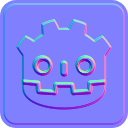
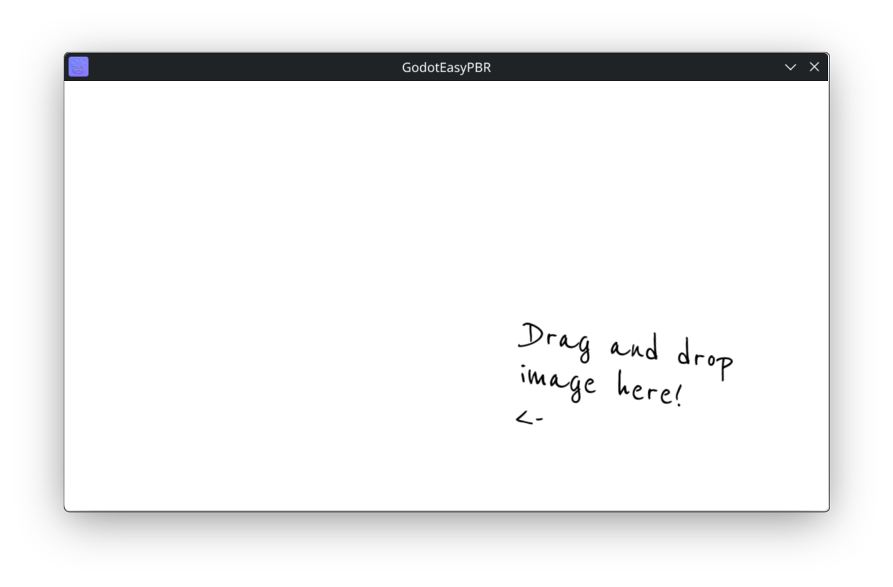
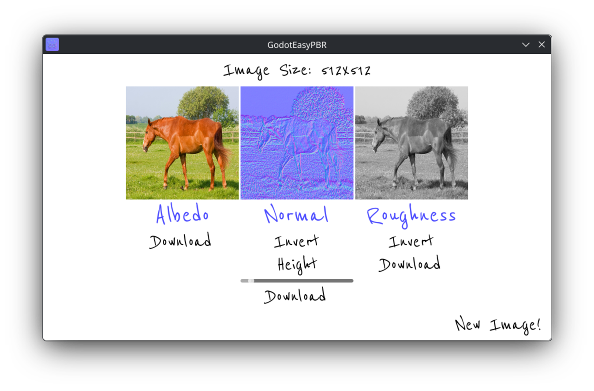

# GodotEasyPBR

A simple PBR texture generator created in Godot for fast textures from a single image!

# Features

- Albedo, Normal and Roughness map creation

- Normal map inverting and height slider adjustment

- Roughness map inverting

- Maps are saved to a local folder next to the executable for easy access!

Created by Jonnie Gieringer
